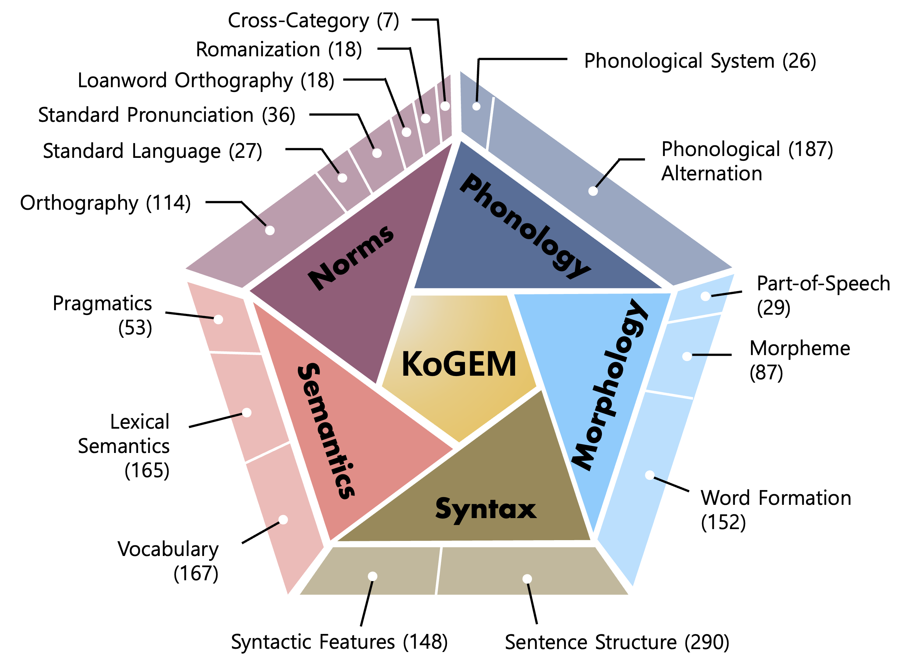

# Polishing Every Facet of the GEM: Testing Linguistic Competence in LLMs and Humans

[![KOGL TYPE 1][kogl-1-shield]][kogl-1]  [![CC BY 4.0][cc-by-shield]][cc-by]

[cc-by]: https://creativecommons.org/licenses/by/4.0/
[cc-by-shield]: https://img.shields.io/badge/License-CC%20BY%204.0-lightgrey.svg

[kogl-1]: https://www.kogl.or.kr/info/license.do
[kogl-1-shield]: https://www.kogl.or.kr/static/kogl/img/sub/number1.jpg

This repository is associated with a paper currently under review for ACL 2025.  
We plan to upload our benchmark and generation results upon acceptance.
  

## KoGEM (<ins>Ko</ins>rean <ins>G</ins>rammar <ins>E</ins>valuation Bench<ins>M</ins>ark)

This presents the components and statistics of our proposed dataset, KoGEM. Our benchmark consists of a total of 1,524 annotated QA pairs. More detailed information about KoGEM can be found in our paper.

 

  
## Zero-shot Evaluation Results for Each Subcategory
A closer examination of individual subcategories. These results reveal distinct strengths and weaknesses, as LLMs and humans excel in different areas, underscoring the need for a fine-grained evaluation of linguistic competence at the subcategory level.

 

  
## License

This work is licensed under a [Creative Commons Attribution 4.0 International License](https://creativecommons.org/licenses/by/4.0/).

This work is used according to [Korea Open Government License (KOGL) Type 1](https://www.kogl.or.kr/info/license.do).

