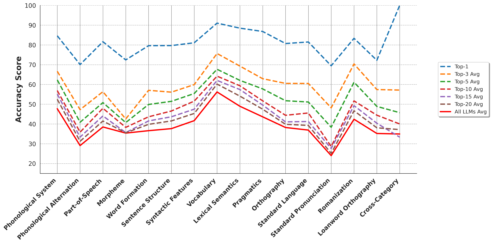
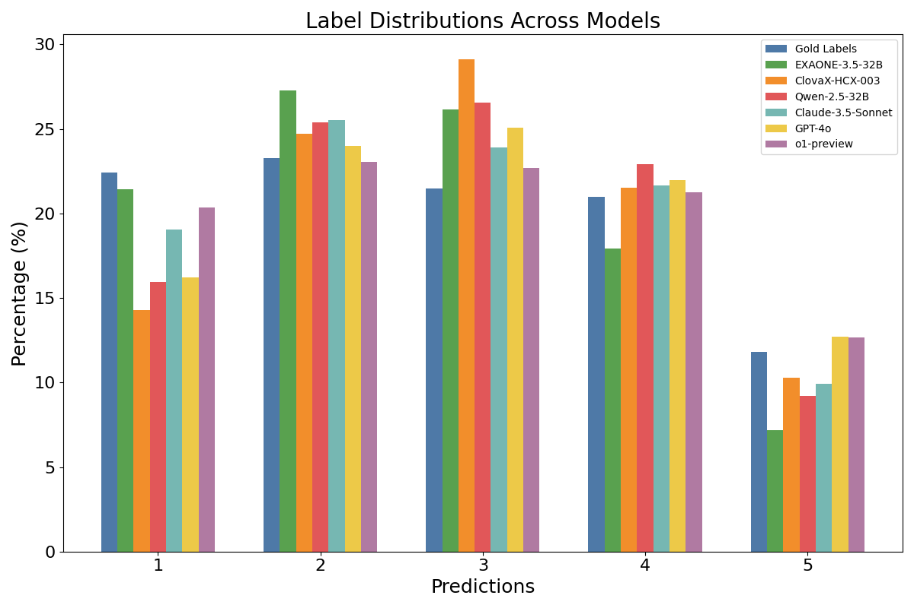

# Polishing Every Facet of the GEM: Testing Linguistic Competence of LLMs and Humans in Korean

[![CC BY 4.0][cc-by-shield]][cc-by]
[![KOGL TYPE 1][kogl-1-shield]][kogl-1]
[![Dataset on HF][hf-data-shield]][hf-data]
[![ACL Paper][acl-paper-shield]][acl-paper]


[cc-by-shield]: https://img.shields.io/badge/License-CC%20BY%204.0-lightgrey.svg
[cc-by]: https://creativecommons.org/licenses/by/4.0/

[kogl-1-shield]: https://img.shields.io/badge/License-KOGL%20Type1%20-lightgreen.svg
[kogl-1]: https://www.kogl.or.kr/info/license.do

[hf-data-shield]: https://img.shields.io/badge/🤗.-Dataset%20Card-blue.svg
[hf-data]: https://huggingface.co/datasets/Poppo/KoGEM

[acl-paper-shield]: https://img.shields.io/badge/📋.-%20ACL_Paper%20-red.svg
[acl-paper]: https://aclanthology.org/2025.acl-long.492/

[acl-paper-shield]: https://img.shields.io/badge/📋.-%20ACL_Paper%20-red.svg
[acl-paper]: https://aclanthology.org/2025.acl-long.492/

This paper is accepted to ACL 2025 main.<br/>
*SungHo Kim<sup>\*</sup>, Nayeon Kim<sup>\*</sup>, Taehee Jeon, SangKeun Lee*


</br>

## Environment Settings
1. Create the virtual environment.
    ```
    conda create -n env_name python=3.9.12
    ```

2. Activate the virtual environment.
    ```
    conda activate env_name
    ```

3. Install the packages from <code>requirements.txt</code>
    ```
    pip install -r requirements.txt
    ```

4. Install the torch toolkit</br>
  Before downloading this Torch package, you should check the compatibility of your CUDA settings.<br/>
  ( We used CUDA 12.2 and cuDNN 8.9.6 with NVIDIA driver 535.183.01 )
    ```
    pip install torch==2.1.0 torchvision==0.16.0 torchaudio==2.1.0 --index-url https://download.pytorch.org/whl/cu121
    ```

<br/><br/>

## KoGEM (<ins>Ko</ins>rean <ins>G</ins>rammar <ins>E</ins>valuation Bench<ins>M</ins>ark)

- KoGEM Taxonomy <br/>
    This presents the components and statistics of our proposed dataset, KoGEM. Our benchmark consists of a total of 1,524 annotated QA pairs. More detailed information about KoGEM can be found in our paper.

    
    </br>


- Statistics of the Prompt Lengths

    

</br></br>


## Zero-shot Evaluation of LLMs on KoGEM

You can assess all LLMs reported in our paper using below comands.<br/>


* Open-source LLMs
  <br/><br/>
  : If you want to resume the evaluation from a specific batch number, set the 'continue_batch_num' parameter.
  <br/><br/>
  ```
  python generations/Huggingface-Models_eval_total.py --torch_model_name simplescaling/s1-32B --batch_size 100
  ```
<br/>
  
    
* Closed-source LLMs
    <br/><br/>
    <b><ins>Notice</ins>: If you want to evaluate closed-source LLMs such as OpenAI's GPT, Claude, Gemini, or the LLaMA series, you must provide your own API access key (token) by placing it in the <code>api_tokens</code> folder as an individual file.</b>
    <br/>
    
    For example,
    ```
    KoGEM
     ㄴ analysis
     ㄴ ...
     ㄴ api_tokens
         ㄴ claude_token.txt
           : sk-aat-api00--VpfeffFJIEJOFJfEesf_d4MpMZkESjoxukLfs5_a_51csEXm9hAYwAA
         ㄴ openai_token.txt
         ㄴ ...
     ㄴ ...
    ```
    <br/>
    
    
    * OpenAI GPT series
        ```
        python generations/OpenAI_eval_total.py --model_var gpt-4o --access_token_path api_tokens/openai_token.txt
        ```
    
    * Claude series
        ```
        python generations/Claude_eval_total.py --model_var claude-3-5-sonnet-20240620 --access_token_path api_tokens/claude_token.txt
        ```
        
    * Gemini series
        ```
        python generations/Gemini_eval_total.py --model_var gemini-2.0-flash-exp --access_token_path api_tokens/gemini_token.txt
        ```
    
    * LLaMA series
        ```
        python generations/Llama_eval_total.py --model_var llama3-70b --access_token_path api_tokens/llama_token.txt
        ```
        
    * HyperCLOVA X series
        ```
        python generations/ClovaX_eval_total.py --model_var HCX-DASH-001 --access_token_path api_tokens/clovax_chat_api_key.txt
        ```
<br/><br/>


## Zero-shot Evaluation Results for Each Subcategory
A closer examination of individual subcategories. These results reveal distinct strengths and weaknesses, as LLMs and humans excel in different areas, underscoring the need for a fine-grained evaluation of linguistic competence at the subcategory level.

</br>


<br>

### Top-k Zero-shot Performance Variation Across Subcategories <br/>



</br>

### Label Distribution: Gold Labels vs. Model Predictions <br/>
This graph compares the label distribution of the gold labels with the distribution of predictions made by the representative model.




</br></br>


## Acknowledgments
Special thanks to **Charlie** for his valuable insights in distinguishing between English and Korean.

</br>


## Citation
```bibtex
@inproceedings{kim-etal-2025-polishing,
    title = "Polishing Every Facet of the {GEM}: Testing Linguistic Competence of {LLM}s and Humans in {K}orean",
    author = "Kim, SungHo  and
      Kim, Nayeon  and
      Jeon, Taehee  and
      Lee, SangKeun",
    editor = "Che, Wanxiang  and
      Nabende, Joyce  and
      Shutova, Ekaterina  and
      Pilehvar, Mohammad Taher",
    booktitle = "Proceedings of the 63rd Annual Meeting of the Association for Computational Linguistics (Volume 1: Long Papers)",
    month = jul,
    year = "2025",
    address = "Vienna, Austria",
    publisher = "Association for Computational Linguistics",
    url = "https://aclanthology.org/2025.acl-long.492/",
    doi = "10.18653/v1/2025.acl-long.492",
    pages = "9955--9984",
    ISBN = "979-8-89176-251-0",
    abstract = "We introduce the $\underline{Ko}rean \underline{G}rammar \underline{E}valuation Bench\underline{M}ark (KoGEM)$, designed to assess the linguistic competence of LLMs and humans in Korean. KoGEM consists of 1.5k multiple-choice QA pairs covering five main categories and 16 subcategories. The zero-shot evaluation of 27 LLMs of various sizes and types reveals that while LLMs perform remarkably well on straightforward tasks requiring primarily definitional knowledge, they struggle with tasks that demand the integration of real-world experiential knowledge, such as phonological rules and pronunciation. Furthermore, our in-depth analysis suggests that incorporating such experiential knowledge could enhance the linguistic competence of LLMs. With KoGEM, we not only highlight the limitations of current LLMs in linguistic competence but also uncover hidden facets of LLMs in linguistic competence, paving the way for enhancing comprehensive language understanding. Our code and dataset are available at: https://github.com/SungHo3268/KoGEM."
}
```
</br>

## License
This work is licensed under a [Creative Commons Attribution 4.0 International License](https://creativecommons.org/licenses/by/4.0/).

This work is used according to [Korea Open Government License (KOGL) Type 1](https://www.kogl.or.kr/info/license.do). <br/>

[![KOGL ORIGINAL TYPE 1][kogl-original-1-shield]][kogl-original-1]

[kogl-original-1-shield]: https://www.kogl.or.kr/static/kogl/img/sub/number1.jpg
[kogl-original-1]: https://www.kogl.or.kr/info/license.do
