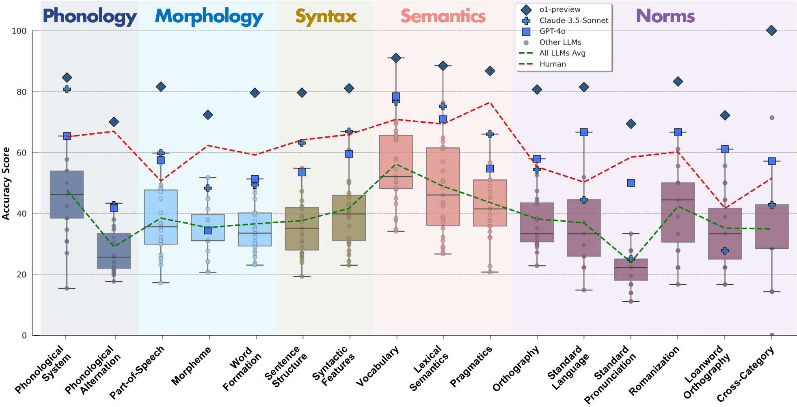

# Polishing Every Facet of the GEM: Testing Linguistic Competence in LLMs and Humans
This repository is associated with a paper currently under review for ACL 2025.
  

## KoGEM (<ins>Ko</ins>rean <ins>G</ins>rammar <ins>E</ins>valuation Bench<ins>M</ins>ark)

This presents the components and statistics of our proposed dataset, KoGEM. Our benchmark consists of a total of 1,524 annotated QA pairs. More detailed information about KoGEM can be found in our paper.

 

  
## Zero-shot Evaluation Results for Each Subcategory
A closer examination of individual subcategories. These results reveal distinct strengths and weaknesses, as LLMs and humans excel in different areas, underscoring the need for a fine-grained evaluation of linguistic competence at the subcategory level.

 

